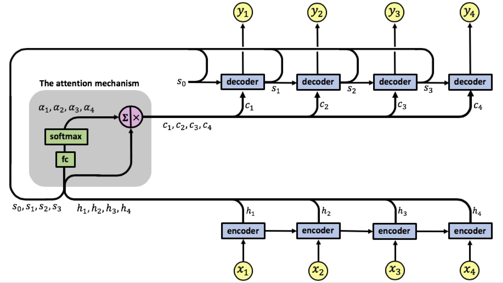

# Session 11 - GRU, Attention Mechanism & Transformers

[](http://face-operations.s3-website-us-east-1.amazonaws.com)
[](https://colab.research.google.com/github/pankaj90382/TSAI-2/blob/master/S11/Translation_by_attention_using_encoder_decoder.ipynb)

The goal of this assignment is to train and deploy a model which can translate sentence from German to English.

All the code for deployment can be found in the [deployment](deployment) directory.

### Parameters and Hyperparameters

- Loss Function: NLLLoss
- Epochs: 10
- Learning Rate: 0.0003
- Optimizer: Adam
- Batch Size: 64

## Results

Since the model was trained on a very small dataset like IWSLT (International Workshop on Spoken Language) Data Set(due to limitations on google colab), the results are not very accurate.

### Input Sentence

```
jeden tag nahmen wir einen anderen weg, sodass niemand erraten konnte, wohin wir gingen.
```

### Output Sentence

```
and every day every day , we took another one that could n't go anywhere . where we went .
```

## Attention Mechanism

A neural network is considered to be an effort to mimic human brain actions in a simplified manner. Attention Mechanism is also an attempt to implement the same action of selectively concentrating on a few relevant things, while ignoring others in deep neural networks.

An attention mechanism allows the model to focus on the currently most relevant part of the source sentence. In this project we implemented additive attention that was used in _Bahdanau et al._

<p align='center'>
      
</p>

## Refrences

 - [Pytorch Seq2Seq Tutorial Deployment](https://pytorch.org/tutorials/beginner/deploy_seq2seq_hybrid_frontend_tutorial.html)
 - [Annonated Encoder & Decoder](https://bastings.github.io/annotated_encoder_decoder/)
 - [Bastings GithubLink for Annoated Encoder and Decoder](https://github.com/bastings/annotated_encoder_decoder)
 - [NLP Basics Pytorch](https://suzyahyah.github.io/pytorch/2019/07/01/DataLoader-Pad-Pack-Sequence.html)
