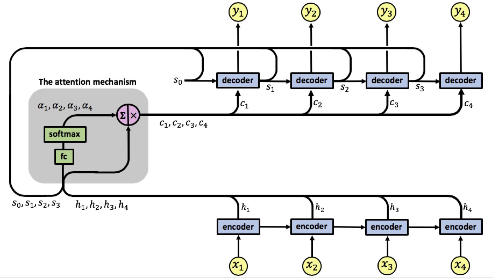

# Session 12 - Image Captioning

The goal of this assignment is to deploy an image caption generation model by using Show, Attend and Tell Model (SNT) on Flicker 8k Dataset. The code for deployment can be found [here](deployment).

### Dataset

#### Flicker 8k 
The Flicker 8k Dataset published by *University of illions of urbana-champaign, Department of Computer Science*. The dataset can be requested by using a [form](https://forms.illinois.edu/sec/1713398). Within a short time, you will receive an email that contains links to two files:

- Flickr8k_Dataset.zip (1 Gigabyte) An archive of all photographs.
- Flickr8k_text.zip (2.2 Megabytes) An archive of all text descriptions for photographs.

*Note:- The links are not working from the recieved mail but the dataset can be downloaded from other source also. [Flickr8k_Dataset.zip](https://github.com/jbrownlee/Datasets/releases/download/Flickr8k/Flickr8k_Dataset.zip) & [Flickr8k_text.zip](https://github.com/jbrownlee/Datasets/releases/download/Flickr8k/Flickr8k_text.zip). Great Thanks to [Jason Brownlee](https://machinelearningmastery.com/prepare-photo-caption-dataset-training-deep-learning-model/)*

The dataset contains:-
- Flicker8k_Dataset: Contains 8092 photographs in jpeg format.
- Flickr8k_text: Contains a number of files containing different sources of descriptions for the photographs

#### Image Captions
The Flicker 8k captions downloaded from paper *[Deep Visual-Semantic Alignments for Generating Image Descriptions, Andrej Karpathy, Stanford University](https://cs.stanford.edu/people/karpathy/deepimagesent/)*. The dataset contains the captions for Flicker 8k, 30k and MSCOCO Dataset.

### Parameters and Hyperparameters

- Encoder: Pre-trained ResNet-18 on ImageNet dataset
- Decoder Learning Rate: 4e-4
- Optimizer: Adam
- Batch Size: 32
- Embedding dimension: 128
- Attention dimension: 128
- Decoder dimension: 128
- Dropout: 0.5

### Image Captioning:
The goal of image captioning is to generate a trusted description for a given image. So we need to ensure the correctness of the objects, attribute information, semantic information, and position relationship information in the description. 
 
Subtask in Image captioning :

1. Understanding the image, acquiring the relevant information correctly with Encoder such as VGG19 . RESNET or DENSENET etc
2. Generating description based on the understanding of the image.(Attentiona and LSTM) 

We can use an encoder to automatically extract image features, and then use LSTM's as decoders to generate descriptions. Encoder-Decoder structure have become the basic framework of image captioning.

### Architecture :

Encoder-Decoder architecture- Typically, a model that generates sequences will use an Encoder to encode the input into a fixed form and a Decoder to decode it, word by word, into a sequence.

 -   Encoder - Encoder Architecture is used to obtain the feature of image provided . The features added with embedding is fed to Decoder. We have used Resnet101 pretrained on MSCOCO.
 -   Decoder - This is usually LSTM cell with Attention Mechanism used to generate the description.

Attention-  Attention models, or attention mechanisms, are input processing techniques for neural networks that allows the network to focus on specific aspects of a complex input, one at a time until the entire dataset is categorized.

      

### Attention Mechanism

A neural network is considered to be an effort to mimic human brain actions in a simplified manner. Attention Mechanism is also an attempt to implement the same action of selectively concentrating on a few relevant things, while ignoring others in deep neural networks.

An attention mechanism allows the model to focus on the currently most relevant part of the source sentence. In this project we implemented additive attention that was used in Bahdanau et al.

      

### Results

|                             Input Image                              |                    Output Caption                    |
| :------------------------------------------------------------------: | :--------------------------------------------------: |
|  |     a man in a wetsuit is surfing on a surfboard     |
|  |      a group of people sit on a snowy mountain       |
|  | a young boy in a red shirt is riding on a tire swing |

## Refrences
 - [Pytorch Image Caption](https://github.com/sgrvinod/a-PyTorch-Tutorial-to-Image-Captioning)
 - [Image Caption Repo](https://github.com/ruotianluo/self-critical.pytorch)
 - [Show, Attend and Tell Model Paper](https://arxiv.org/abs/1502.03044)
 - [Original Deployment of Show, Attend and Tell](https://github.com/kelvinxu/arctic-captions)
 - [Image Caption](https://github.com/AaronCCWong/Show-Attend-and-Tell)
