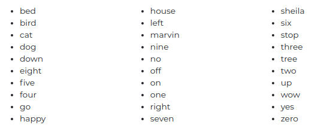
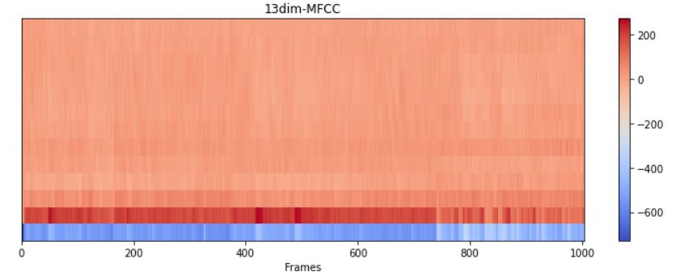
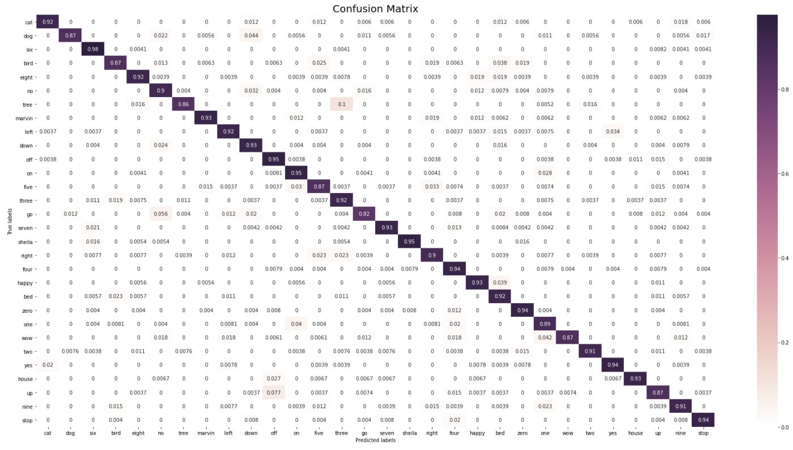

# Session 13 - AI for Sound

## Basic Audio Processing and a Simple Model

### Objective

The goal of this assignment is to increase the [accuracy](https://colab.research.google.com/drive/1z6Ia_zT9HbAd6zxpafDVzd1Q0klMGaA4?usp=sharing), train the model and [deploy](deployment/STT) a simple asr model that can transcribe one-word utterances. Only the utterances of the following 30 words are supported by the model.

  

Problem Identification In Model:- Passing directly audio without extracting the features(mfcc). The accuracy will increase almost **50%** and reduced trainning time from 1 hour to 5 min for each epoch.

- Passing mfcc rather than waveform directly.
- Update RNN to capture 12 inputs rather than 1

### Dataset

We use [Google's Speech Dataset](https://ai.googleblog.com/2017/08/launching-speech-commands-dataset.html) to train the model. The dataset consists of 65,000 one-second long utterances of 30 short words, by thousands of different people.

### Model Hyperparameters

* Hidden size - 256
* Mel Frequency Cepstral Coefficients (MFCC) - 12
* Batch size - 16
* Epochs - 5
* Learning rate - 0.001
* Loss function - Cross Entropy Loss (LogSoftmax + NLL Loss)

### Model Architecture

Speech to text model is based on Recurrent Neural network. GRU (Gated Recurrent network) with 2 layers and 256 hidden units has been used. Audio samples have been transformed by Mel Frequency Cepstrum and the derived Mel-frequency cepstral coefficients (MFCCs) are fed to the RNN network.

Model has been trained on Google Launch command dataset, 65K audio samples of one second long utterances of 30 short words. The ASR model is able to detect 30 words. 

### Mel Frequency Cepstral Coefficients (MFCCs)

Mel Frequency Cepstral Coefficents (MFCCs) are a feature widely used in automatic speech and speaker recognition. The Mel scale relates perceived frequency, or pitch, of a pure tone to its actual measured frequency. It is based on a linear cosine transform of a log power spectrum on a nonlinear mel scale of frequency.

### Results

The model achieves an accuracy of **92%** on the test dataset. To test the model, go to the [deployment link](http://face-operations.s3-website-us-east-1.amazonaws.com/).
Confusion matrix for the 30 word classification is shared here-

## Building an end-to-end SPeech Recognition model in PyTorch
