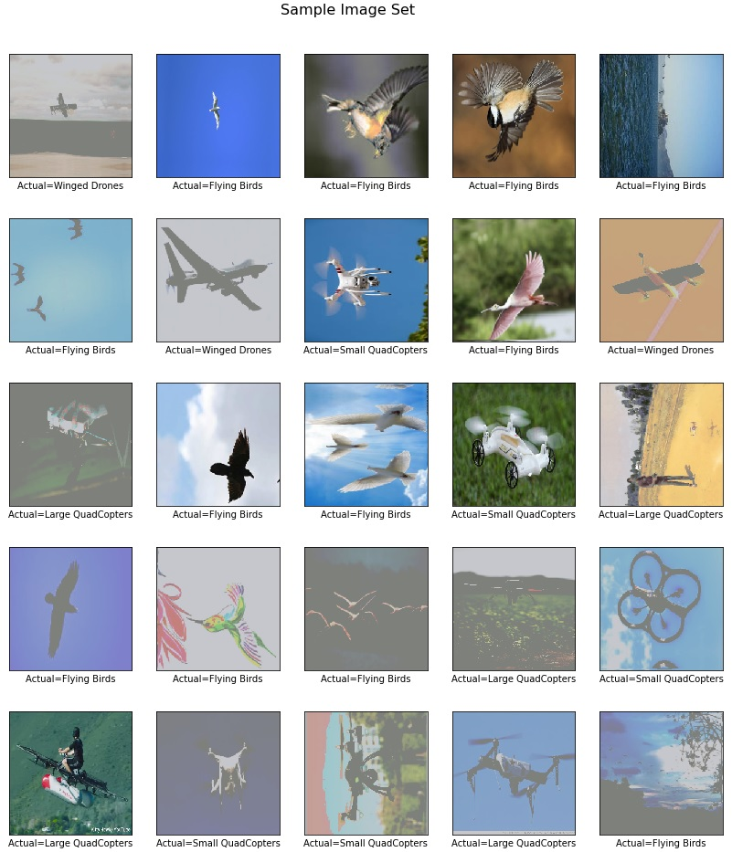
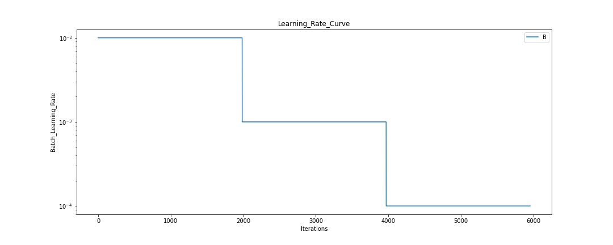
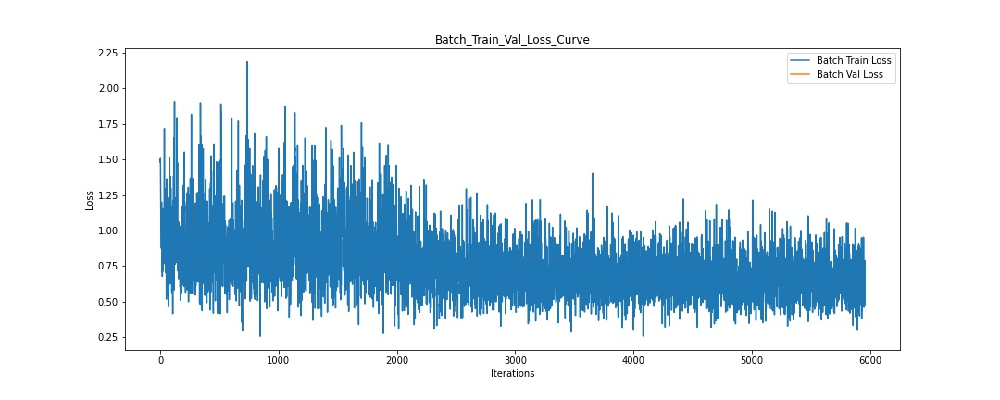
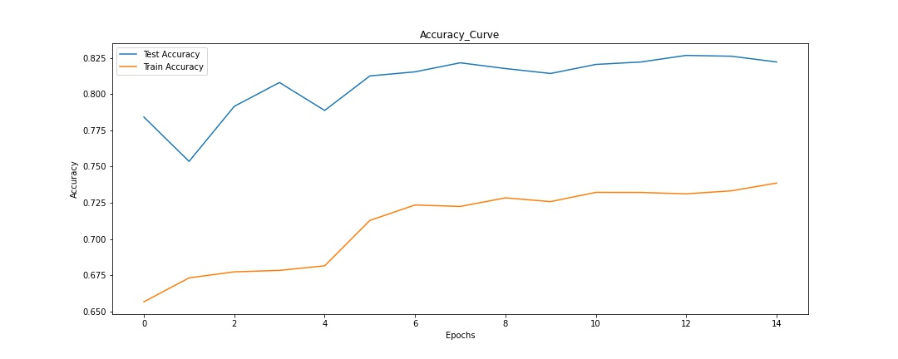
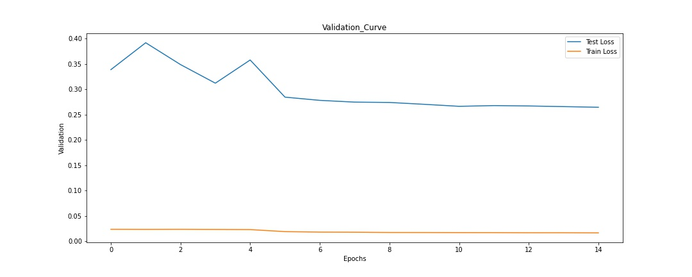
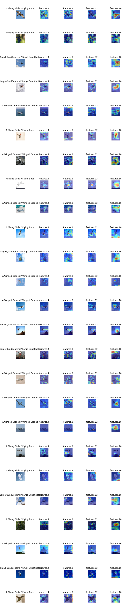
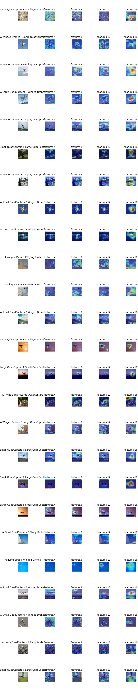

# Session 2 - Transfer Learning with Custom Classes on Mobile-Net v2 Architecture (Using Pretrained Imagenet Model)

## Objective
Deployed Mobile Net v2 by using serverless on AWS Cloud Formation. The AWS Cloud Formation will gather the multiple resources to start the application and we can manage the resources from single stack. For Computing of the model used AWS Lambda (event based trigger). The API gateway to manage the requests. S3 storage used as model storage and temporary storage.

## Prerequisite
1.  **Node JS** 
2.  **Docker**
3.  **Serverless (SLS)** 
4.  **AWS Free Tier Account**
5.  **Conda**
6.  **Pytorch**

## Pre-Trained Model
The mobilenetv2 can be easily obtained from the torcha and torchvision model. Please run below lines of code to get the pre-trained model.

           import torch
           model = torch.hub.load('pytorch/vision:v0.6.0', 'mobilenet_v2', pretrained=True)
           model.eval()
           traced_model= torch.jit.trace(model, torch.randn(1,3,224,224))
           traced_model.save(mobilenetv2.pt')
 
 ## Download labels of Imagenet 1000
 Download the labels from this [link](https://gist.github.com/yrevar/942d3a0ac09ec9e5eb3a)
 
 ## Upload to S3 Bucket
 Now create any S3 Bucket in AWS and upload the model and labels in S3 Bucket. Please be ensure that S3 bucket regoin and your serverless deploy region will be same. I am choosing the region us-east-1 (North Virgina) to deploy my application. The final result will be appear like this.
 
 

## Deploy the Model
Store the credentials in `~/.aws/credentails` to run the serverless application. Install the requirements plugin in the serverless app.
      `serverless plugin install -n serverless-python-requirements`
Now run the command.
      `serverless deploy`

## Learning Rate
Go to your API gateway and do the following steps shown in the image. I have seen the issues when first time you run the model the uploaded image in the binary format. If you redeploy again the issue will be gone and the API Gateway will convert your images into the HEX format and your code will run fine. While redeploying there is no need to delte the stack. Just use the `serverless deploy` command again. In the end it will shows you the url of the api-gateway to accept your requests.

## Results
Now paste the link in the Postman. Select the image you want to test it. Go into the Body and choose from-data. In the header add one more key and add the content-type with their key and value will be multipart/form-data. Initially the AWS Lambda will be in cool stage so your first two request will be server timeout. After that will predict your predictions.

## GradCam Results

### Appendix
 - Great thanks to the [blog.](https://www.analyticsvidhya.com/blog/2019/10/how-to-master-transfer-learning-using-pytorch/)
 - [Pytorch Transfer Learning](https://pytorch.org/tutorials/beginner/transfer_learning_tutorial.html) 
 - [Pytorch Neural Transfer Style](https://pytorch.org/tutorials/advanced/neural_style_tutorial.html)

