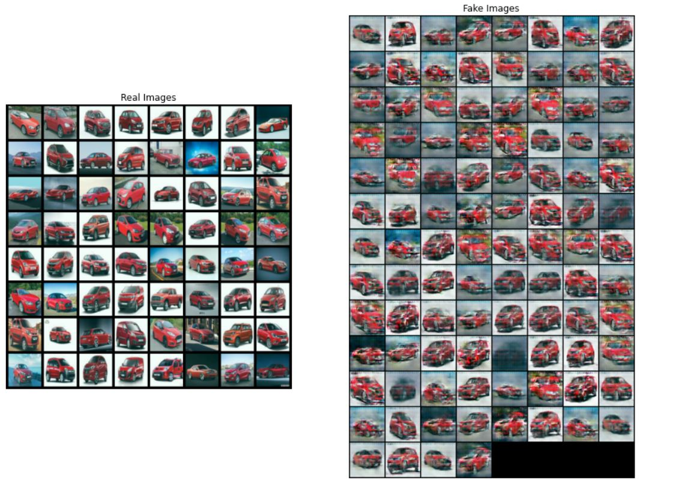
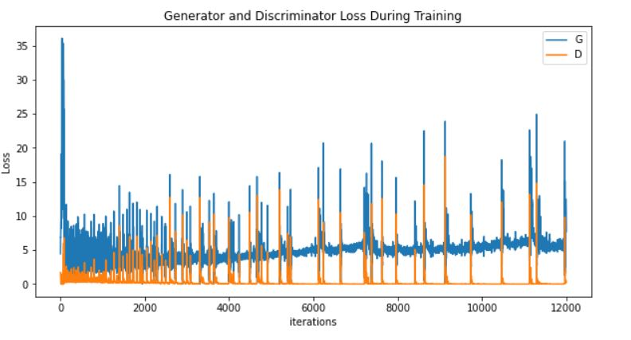
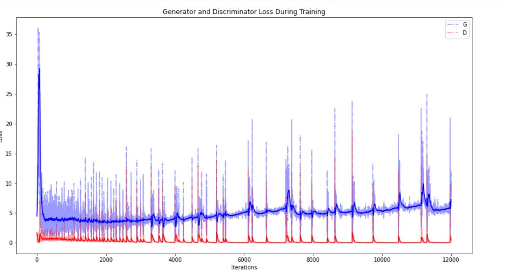
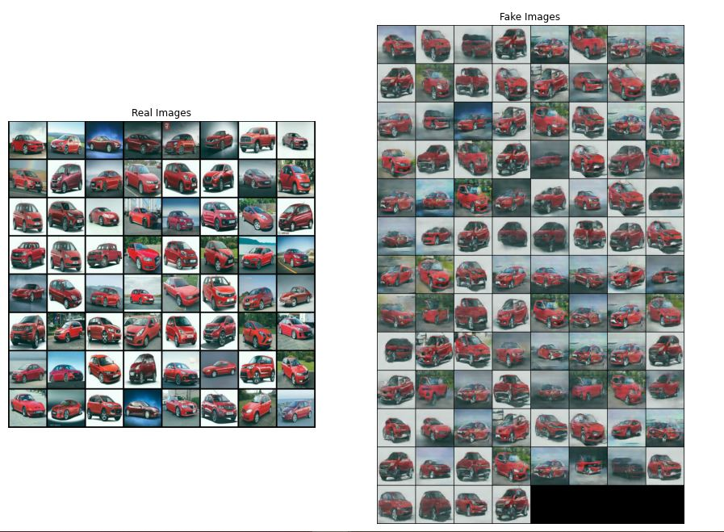
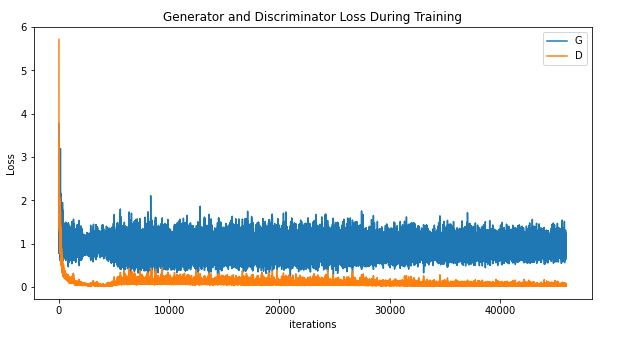

# Session 6 - Generative Adversarial Networks

The goal of this assignment is to create an interactive website that generates Indian cars.

All the files and the models have to be deployed to AWS Lambda. The code to deploy them can be found [here](deployment/).

## APPROACH 1: DCGAN

### Concept

A framework for estimating generative models via an adversarial process, in which we simultaneously train two models: a generative model G that captures the data distribution, and a discriminative model D that estimates the probability that a sample came from the training data rather than G. The training procedure for G is to maximize the probability of D making a mistake. This framework corresponds to a minimax two-player game. In the space of arbitrary functions G and D, a unique solution exists, with G recovering the training data distribution and D equal to 1/2 everywhere. In the case where G and D are defined by multilayer perceptrons, the entire system can be trained with backpropagation.There is no need for any Markov chains or unrolled approximate inference networks during either training or generation of samples. Experiments demonstrate the potential of the framework through qualitative and quantitative evaluation of the generated samples.
     

  PIC Credit:[KDnuggets](https://www.kdnuggets.com/2017/01/generative-adversarial-networks-hot-topic-machine-learning.html)
  
  ### Parameters and Hyperparameters

- Loss Function: Binary Cross Entropy Loss
- Epochs: 2000
- Optimizer: Adam
- Learning Rate: 0.0002
- Batch Size: 256
- Image Size: 64
- Latent Vector: 100
- Beta 1 Hyperparameter: 0.5

### Result: 

    

### Generator and Discriminator Loss During Training
|                               Real Loss                               |                          Smooth Curve Loss                            |
| :-------------------------------------------------------------------: | :-------------------------------------------------------------------: |
| | |

### Animation of Training Set

 
 
 ## APPROACH 2:LSGAN
 
 ### Concept
 
Unsupervised learning with generative adversarial networks (GANs) has proven hugely successful. Regular GANs hypothesize the discriminator as a classifier with the sigmoid cross entropy loss function. However, we found that this loss function may lead to the vanishing gradients problem during the learning process. To overcome such a problem, we propose in this paper the Least Squares Generative Adversarial Networks (LSGANs) which adopt the least squares loss function for the discriminator. We show that minimizing the objective function of LSGAN yields minimizing the Pearson χ2 divergence. There are two benefits of LSGANs over regular GANs. First, LSGANs are able to generate higher quality images than regular GANs. Second, LSGANs perform more stable during the learning process. We evaluate LSGANs on five scene datasets and the experimental results show that the images generated by LSGANs are of better quality than the ones generated by regular GANs. We also conduct two comparison experiments between LSGANs and regular GANs to illustrate the stability of LSGANs.

### Parameters and Hyperparameters

- Loss Function: Mean Square Error Loss
- Epochs: 2000
- Optimizer: Adam
- Learning Rate: 0.0002
- Batch Size: 64
- Image Size: 128
- Latent Vector: 100
- Beta 1 Hyperparameter: 0.9

### Result: 

    

### Generator and Discriminator Loss During Training
|                               Real Loss                               |                          Smooth Curve Loss                            |
| :-------------------------------------------------------------------: | :-------------------------------------------------------------------: |
| | |

### Animation of Training Set

 
## Refrences

 -  [Pytorch DCGAN Implementation](https://pytorch.org/tutorials/beginner/dcgan_faces_tutorial.html)
 -  [LSGAN PYTORCH IMPEMENTATION](https://github.com/eriklindernoren/PyTorch-GAN)
 -  [DCGAN Paper](https://arxiv.org/pdf/1406.2661.pdf))
 -  [LSGAN Paper](https://arxiv.org/pdf/1611.04076.pdf)
