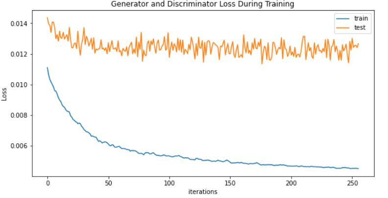

# Session 7 - Variation Auto Encoders

The goal of this assignment is to create an interactive website that generates Indian cars.

All the files and the models have to be deployed to AWS Lambda. The code to deploy them can be found [here](deployment/).

## VAE

### Concept
Variational Autoencoders (VAEs) have one fundamentally unique property that separates them from vanilla autoencoders, and it is this property that makes them so useful for generative modeling: their latent spaces are, by design, continuous, allowing easy random sampling and interpolation.

It achieves this by doing something that seems rather surprising at first: making its encoder not output an encoding vector of size n, rather, outputting two vectors of size n: a vector of means, μ, and another vector of standard deviations, σ.

  
  
### Parameters and Hyperparameters

- Loss Function: Binary Cross Entropy Loss
- Epochs: 900
- Optimizer: Adam
- Learning Rate: 0.001
- Batch Size: 32
- Image Size: 128
- Latent Vector: 100
- Beta 1 Hyperparameter: 0.5
- MSE Loss
- Reduce LR on Plateau
- factor: 0.95

### Result: 

    

### Loss During Training
|                               Real Loss                               |                          Smooth Curve Loss                            |
| :-------------------------------------------------------------------: | :-------------------------------------------------------------------: |
| | |

### Animation of Training Set

|                               Reconstructed Images                    |                          Generated Images                             |
| :-------------------------------------------------------------------: | :-------------------------------------------------------------------: |
|                                        |                                     |

### Observations
-  Difficult to train on VAE as slight changes in learning rate, it will increase the KLD Loss expotentially.
-  Make sure your KLD Loss will be lower from your reconstruction loss
-  Used Reduce LR on Plateau, choose factor 0.95-0.99 range otherwise your learning rate will decrease drastically. Network will not able to reduce your trainning loss and testing loss.

## Refrences
-  [Pytorch VAE Implementation](https://github.com/AntixK/PyTorch-VAE)
-  [VAE Implementation](https://github.com/coolvision/vae_conv/blob/master/mvae_conv.py)
