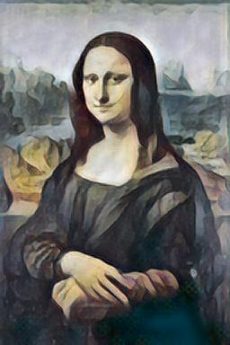

# Neural Style Transfer

Neural Style Transfer is used to compose an image in the style of another image. It takes an input image and reproduces it with a new artistic style. The algorithm takes three images, an input image, a content-image, and a style-image, and changes the input to resemble the content of the content-image and the artistic style of the style-image.

All the files and the models have to be deployed to AWS Lambda. The code to deploy them can be found [here](deployment/).

## Results

<TABLE>
  <TR>
    <TH>Style Image</TH>
    <TH>Content Image</TH>
    <TH>Output Image</TH>
  </TR>
   <TR>
      <TD></TD>
      <TD></TD>
      <TD></TD>
   </TR>
   <TR>
      <TD></TD>
      <TD></TD>
      <TD></TD>
   </TR>
</TABLE>

## Real Time Neural Style Refrences
- [Amazing Example by Pytorch on Fast Neural AI](https://github.com/pytorch/examples/tree/master/fast_neural_style)
- [Pytorch Implementation](https://pytorch.org/tutorials/advanced/neural_style_tutorial.html)
- [Real Time Neyral Style Transfer](https://github.com/zhanghang1989/PyTorch-Multi-Style-Transfer#msg-net)
- [Fast Neural AI](https://github.com/williamFalcon/fast-neural-style)
